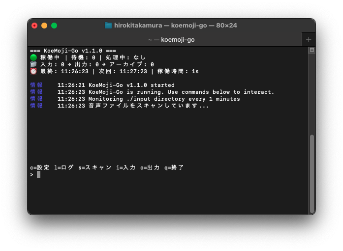

# KoeMoji-Go

音声・動画ファイル自動文字起こしツール

**日本語版 README** | [English README](README_EN.md)

## 概要

KoeMoji-Goは、音声・動画ファイルを自動で文字起こしするGoアプリケーションです。
Python版のKoeMojiAuto-cliをGoに移植し、シングルバイナリでの配布と順次処理による安定動作を実現しています。



## 特徴

- **シングルバイナリ**: 実行ファイル1つで動作
- **順次処理**: 1ファイルずつ安定した処理
- **FasterWhisper連携**: 高精度な音声認識
- **クロスプラットフォーム**: Windows/Mac対応
- **自動監視**: フォルダを定期的に監視して自動処理
- **リアルタイムUI**: 処理状況をリアルタイム表示

## 1. 動作要件の確認

### システム要件
- **OS**: Windows 10/11, macOS 10.15+
- **CPU**: Intel/AMD 64bit, Apple Silicon
- **メモリ**: 4GB以上推奨（8GB以上でより快適）
- **ストレージ**: 5GB以上（Whisperモデルファイル含む）

### 必須の前提条件

#### Python 3.8以上のインストール
KoeMoji-GoはFasterWhisperを使用するため、**Python 3.8以上が必須**です。

**Pythonのバージョン確認：**
```bash
python --version
# または
python3 --version
```

**Pythonがインストールされていない場合：**

**Windows:**
1. [Python公式サイト](https://www.python.org/downloads/windows/)からダウンロード
2. インストール時に「Add Python to PATH」をチェック
3. 推奨バージョン: Python 3.11以上

**macOS:**
```bash
# Homebrewを使用
brew install python

# または公式サイトからダウンロード
# https://www.python.org/downloads/macos/
```


#### pipの確認
```bash
pip --version
# または
pip3 --version
```

pipが利用できない場合：
```bash
# macOS
python3 -m ensurepip --upgrade

# Windows
python -m ensurepip --upgrade
```

## 2. インストール

### ダウンロード
1. **[GitHubリリースページ](https://github.com/hirokitakamura/koemoji-go/releases)から対応OS版をダウンロード**

**Windows版**: `koemoji-go-windows-1.1.0.zip`
```
📁 koemoji-go-windows-1.0.0.zip
├── koemoji-go.exe     # アイコン付き実行ファイル
├── config.json        # 設定ファイル
└── README.md          # 説明書
```

**macOS Intel版**: `koemoji-go-macos-intel-1.1.0.tar.gz`
```
📁 koemoji-go-macos-intel-1.0.0.tar.gz  
├── koemoji-go         # Intel Mac用実行ファイル
├── config.json        # 設定ファイル
└── README.md          # 説明書
```

**macOS Apple Silicon版**: `koemoji-go-macos-arm64-1.1.0.tar.gz`
```
📁 koemoji-go-macos-arm64-1.0.0.tar.gz  
├── koemoji-go         # Apple Silicon用実行ファイル
├── config.json        # 設定ファイル
└── README.md          # 説明書
```


2. **ダウンロードファイルを展開**

3. **初回実行時、FasterWhisperが自動インストールされます**

### 手動インストールが必要な場合
```bash
pip install faster-whisper whisper-ctranslate2
```

## 3. 初回実行

### 基本実行

**Windows:**
```cmd
koemoji-go.exe
```

**macOS:**
```bash
./koemoji-go
```


初回実行時は自動的にデフォルト設定で起動します。設定は実行後に`c`キーで変更可能です。

### PATHに追加（オプション）

どこからでも実行できるようにPATHに追加できます：

**macOS:**
```bash
# バイナリをPATHに追加
sudo cp koemoji-go /usr/local/bin/koemoji-go
sudo chmod +x /usr/local/bin/koemoji-go

# エイリアス設定（お好みで）
echo 'alias koe="koemoji-go"' >> ~/.zshrc  # zshの場合
echo 'alias koe="koemoji-go"' >> ~/.bashrc # bashの場合
source ~/.zshrc  # 設定を反映
```

**Windows:**
```cmd
# PATHの設定は環境変数から手動で設定してください
# または実行ファイルのあるフォルダでコマンドプロンプトを開いてください
```

これで`koemoji-go`または`koe`コマンドで実行できます。

初回実行時に以下が自動作成されます：
- `input/` - 処理対象ファイル置き場
- `output/` - 処理結果出力先  
- `archive/` - 処理済みファイル保管
- `koemoji.log` - ログファイル

## 4. 基本的な使い方

### ステップ1: 音声ファイルを準備
- 対応ファイルを`input/`フォルダに配置
- 複数ファイルも同時に処理可能

### ステップ2: 処理状況を確認
- リアルタイムでUI画面に処理状況が表示されます
- 完了したファイルは自動的に`archive/`に移動
- 文字起こし結果は`output/`フォルダに保存

### 処理の流れ
```
[input/音声ファイル] → [文字起こし処理] → [output/テキストファイル]
                                    ↓
                            [archive/処理済みファイル]
```

- 10分間隔で自動的に`input/`フォルダをスキャン
- 新しいファイルが見つかると順次処理を開始
- 処理完了後、元ファイルは`archive/`に移動

## 5. 対話操作

実行中に以下のキーで操作できます：
- `c` - 設定変更
- `l` - ログ表示
- `s` - 手動スキャン
- `i` - 入力ディレクトリを開く
- `o` - 出力ディレクトリを開く
- `q` - 終了

## 6. 対応ファイル形式

- **音声**: MP3, WAV, M4A, FLAC, OGG, AAC
- **動画**: MP4, MOV, AVI

## 7. 設定のカスタマイズ

`config.json`で動作をカスタマイズできます：

```json
{
  "whisper_model": "large-v3",
  "language": "ja",
  "scan_interval_minutes": 10,
  "max_cpu_percent": 95,
  "compute_type": "int8",
  "use_colors": true,
  "ui_mode": "enhanced"
}
```

### 設定項目

- `whisper_model`: Whisperモデル（tiny, base, small, medium, large, large-v2, large-v3）
- `language`: 言語コード（ja, en等）
- `scan_interval_minutes`: フォルダ監視間隔（分）
- `max_cpu_percent`: CPU使用率上限（現在未使用）
- `compute_type`: 量子化タイプ（int8, float16等）
- `use_colors`: カラー表示の有効/無効
- `ui_mode`: UI表示モード（enhanced/simple）

### Whisperモデルの選択

| モデル | サイズ | 処理速度 | 精度 | 推奨用途 |
|--------|--------|----------|------|----------|
| tiny | 最小 | 最速 | 低 | テスト用 |
| base | 小 | 速い | 中 | 簡単な音声 |
| small | 中 | 普通 | 中 | バランス重視 |
| medium | 大 | 遅い | 高 | 品質重視 |
| large | 最大 | 最遅 | 最高 | 高精度（旧版） |
| large-v2 | 最大 | 最遅 | 最高 | 多言語改善版 |
| large-v3 | 最大 | 最遅 | 最高 | **日本語推奨** |

**推奨**: 日本語の文字起こしには`large-v3`が最適です（ハルシネーション大幅減少）。

## 8. コマンドラインオプション

```bash
./koemoji-go -config custom.json  # カスタム設定ファイル
./koemoji-go -debug               # デバッグモード
./koemoji-go -version             # バージョン表示
./koemoji-go -help                # ヘルプ表示
./koemoji-go -configure           # 設定モード
```

## 9. トラブルシューティング・FAQ

### 環境・インストール関連

**Q: "Python not found" エラーが出る**
```
A: Pythonがインストールされていません
- 上記「1. 動作要件の確認」に従ってPython 3.8以上をインストール
- インストール後、ターミナル/コマンドプロンプトを再起動
- Windowsの場合、インストール時に「Add Python to PATH」をチェック
```

**Q: Pythonはあるが古いバージョン（3.7以下）**
```bash
# バージョン確認
python --version

# 新しいバージョンをインストール（推奨: 3.11以上）
# Windows: 公式サイトから最新版をダウンロード
# macOS: brew install python
```

**Q: FasterWhisperのインストールに失敗する**
```bash
# 手動インストール
pip install faster-whisper whisper-ctranslate2

# pipが古い場合
pip install --upgrade pip
pip install faster-whisper whisper-ctranslate2

# 権限エラーの場合
pip install --user faster-whisper whisper-ctranslate2

# 仮想環境での実行
python -m venv venv
source venv/bin/activate  # Windows: venv\Scripts\activate
pip install faster-whisper whisper-ctranslate2
```

**Q: "whisper-ctranslate2 not found" エラー**
```bash
# パッケージ確認
pip show whisper-ctranslate2
pip list | grep whisper

# パス確認
which whisper-ctranslate2        # macOS
where whisper-ctranslate2        # Windows

# 再インストール
pip uninstall whisper-ctranslate2 faster-whisper
pip install faster-whisper whisper-ctranslate2
```

### 実行・操作関連

**Q: アプリケーションが起動しない**
```
A: 以下を順番に確認：
1. 実行権限: chmod +x koemoji-go
2. Python環境: python --version
3. ログ確認: cat koemoji.log
4. 設定ファイル: config.jsonが正しい形式か確認
```

**Q: 音声ファイルが処理されない**
```
A: 以下を確認：
- 対応形式: MP3, WAV, M4A, FLAC, OGG, AAC, MP4, MOV, AVI
- ファイル名: 日本語・特殊文字を避ける
- ファイルサイズ: 極端に大きなファイル（>2GB）は処理できない場合あり
- ファイル破損: 他のプレーヤーで再生可能か確認
- 権限: ファイルの読み取り権限があるか確認
```

**Q: ディレクトリが開かない（i/oコマンド）**
```
A: プラットフォーム別の対応：
- Windows: explorerが利用可能か確認
- macOS: Finderが利用可能か確認
```

**Q: 設定変更（cキー）が反映されない**
```
A: 以下を確認：
1. 設定保存の確認: config.jsonファイルが更新されているか
2. アプリ再起動: 一度終了（q）して再実行
3. 設定ファイル権限: config.jsonに書き込み権限があるか
4. JSON形式: 設定ファイルが正しいJSON形式か確認
```

### パフォーマンス・品質関連

**Q: 処理が非常に遅い**
```
A: 以下の最適化を試す：
1. モデル変更: large-v3 → medium → small → tiny
2. compute_type確認: "int8"が最速（デフォルト）
3. CPU使用率: タスクマネージャーでCPU使用状況確認
4. メモリ不足: 8GB以上のRAM推奨
5. 他のプロセス: 重いアプリケーションを終了
```

**Q: 文字起こし結果が不正確**
```
A: 品質向上のために：
1. モデル変更: tiny/small → medium → large-v3
2. 音声品質確認: ノイズ除去、音量調整
3. 言語設定: config.jsonのlanguageが"ja"になっているか
4. 音声クリアさ: 発話がはっきりしているか
5. 背景音: 音楽・雑音が少ない環境で録音
```

**Q: 日本語が正しく認識されない**
```
A: 以下を確認・設定：
1. language設定: "ja"に設定
2. モデル: large-v3を推奨（日本語最適化）
3. 音声品質: クリアな日本語発話
4. 方言: 標準的な発話の方が認識精度が高い
```

### エラー・異常終了関連

**Q: 突然終了する・クラッシュする**
```
A: 原因調査方法：
1. ログ確認: tail -f koemoji.log
2. メモリ不足: システムモニターでメモリ使用量確認
3. ディスク容量: 出力先の空き容量確認
4. 権限エラー: input/output/archiveディレクトリの権限確認
5. 破損ファイル: 問題のある音声ファイルを特定・除外
```

**Q: "Config file not found" が表示される**
```
A: 正常な動作です
- config.jsonがない場合、デフォルト設定で起動
- 設定を変更したい場合は、実行中にcキーで設定可能
- または: cp config.example.json config.json
```

**Q: ログファイルが肥大化する**
```bash
# ログファイルのクリア
> koemoji.log

# またはファイル削除
rm koemoji.log

# 次回実行時に新しいログファイルが作成されます
```

### 高度な設定・カスタマイズ

**Q: 複数の設定を使い分けたい**
```bash
# 設定ファイルを分ける
cp config.json config-fast.json    # 高速処理用
cp config.json config-quality.json # 高品質処理用

# 使い分け
./koemoji-go -config config-fast.json
./koemoji-go -config config-quality.json
```

**Q: 監視間隔を変更したい**
```json
{
  "scan_interval_minutes": 5  // 5分間隔（デフォルト:10分）
}
```

**Q: 出力フォーマットを変更したい**
```json
{
  "output_format": "srt"  // txt, vtt, srt, tsv, json
}
```

**Q: 入力・出力ディレクトリを変更したい**
```json
{
  "input_dir": "/Users/username/Desktop/音声",
  "output_dir": "/Users/username/Desktop/文字起こし",
  "archive_dir": "/Users/username/Desktop/処理済み"
}
```

### ログの確認

問題が発生した場合は`koemoji.log`を確認してください：
```bash
# ログファイルの確認
cat koemoji.log

# 最新のログのみ確認
tail -f koemoji.log
```

---

## 開発者向け情報

### ビルド方法

#### 簡単ビルド（アイコン付き・推奨）
```bash
# 全プラットフォーム向けアイコン付きビルド
./build.sh

# 特定プラットフォームのみ
./build.sh windows   # Windows版のみ
./build.sh macos     # macOS版のみ

# ビルド成果物のクリーンアップ
./build.sh clean
```

**生成されるファイル:**
- Windows: `koemoji-go-windows-1.1.0.zip` (アイコン付き.exe)
- macOS Intel: `koemoji-go-macos-intel-1.1.0.tar.gz` (Intel Mac専用)
- macOS Apple Silicon: `koemoji-go-macos-arm64-1.1.0.tar.gz` (M1/M2 Mac専用)

#### 開発用シンプルビルド
```bash
go build -o koemoji-go main.go
```

#### 手動ビルド（アイコンなし）
```bash
# Windows 64bit
GOOS=windows GOARCH=amd64 go build -o koemoji-go-windows-amd64.exe main.go

# macOS Intel
GOOS=darwin GOARCH=amd64 go build -o koemoji-go-darwin-amd64 main.go

# macOS Apple Silicon
GOOS=darwin GOARCH=arm64 go build -o koemoji-go-darwin-arm64 main.go
```

### 開発環境セットアップ

#### 必要ツール
- Go 1.21以上
- Python 3.8以上 + FasterWhisper（テスト用）
- Git

#### セットアップ手順
```bash
git clone https://github.com/hirokitakamura/koemoji-go.git
cd koemoji-go
go mod tidy
go build -o koemoji-go main.go
```

### 技術仕様

#### アーキテクチャ
- **言語**: Go 1.21
- **依存関係**: 標準ライブラリのみ
- **外部連携**: FasterWhisper（whisper-ctranslate2）
- **処理方式**: 順次処理（1ファイルずつ）

#### 主要機能
- 自動ディレクトリ監視
- リアルタイムUI表示
- ログ管理
- 設定ファイル管理
- クロスプラットフォーム対応

## ライセンス

**個人利用**: 自由に使用可能  
**商用利用**: 事前連絡が必要

詳細は[LICENSE](LICENSE)ファイルをご確認ください。

## 作者

KoeMoji-Go開発チーム
連絡先: dev@habitengineer.com