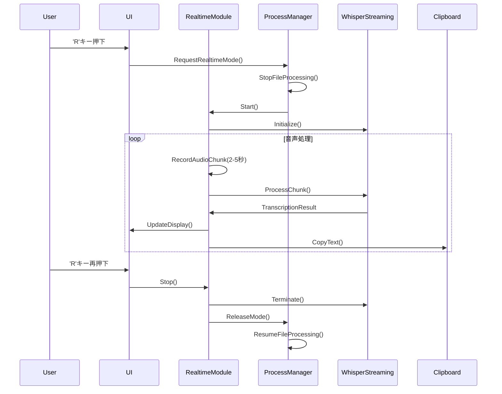

# KoeMoji-Go リアルタイム文字起こし機能 設計書

## 1. 概要

### 1.1 目的
KoeMoji-Goに音声入力のリアルタイム文字起こし機能を追加し、ユーザーが話した内容を即座にテキスト化して利用できるようにする。

### 1.2 スコープ
- リアルタイム音声認識（2-5秒のレイテンシー）
- 自動クリップボードコピー機能
- 既存のファイル処理機能との共存
- 日本語・英語対応

### 1.3 非機能要件
- レイテンシー: 3秒以内
- 精度: 軽量モデル使用時でも実用レベル
- リソース使用: CPU使用率50%以下、メモリ1GB以下
- 安定性: 長時間連続使用可能

## 2. アーキテクチャ

### 2.1 システム構成図

```
┌─────────────────────────────────────────────────────┐
│                  KoeMoji-Go 本体                     │
│  ┌─────────────────┐    ┌─────────────────┐       │
│  │  File Processor │    │ Realtime Module │       │
│  │   (既存機能)     │    │   (新機能)       │       │
│  └────────┬────────┘    └────────┬────────┘       │
│           │                       │                 │
│           └───────────┬───────────┘                 │
│                       │                             │
│              ┌────────▼────────┐                   │
│              │ Process Manager │                   │
│              │  (排他制御)      │                   │
│              └────────┬────────┘                   │
└───────────────────────┼─────────────────────────────┘
                        │
                ┌───────▼───────┐
                │ Whisper Engine │
                │  (外部プロセス)  │
                └────────────────┘
```

### 2.2 コンポーネント設計

#### 2.2.1 Realtime Module (`internal/realtime/`)
```go
// realtime.go
type RealtimeTranscriber struct {
    config      *RealtimeConfig
    audioBuffer *CircularBuffer
    streaming   *StreamingEngine
    clipboard   *ClipboardManager
    status      *Status
}

// config.go
type RealtimeConfig struct {
    ChunkDuration   time.Duration  // 2-5秒
    Model          string         // "tiny", "base", "small"
    Language       string         // "ja", "en", "auto"
    AutoClipboard  bool           // 自動コピー有効/無効
    Backend        string         // "whisper-streaming", "native"
}
```

#### 2.2.2 Streaming Engine (`internal/realtime/streaming/`)
```go
type StreamingEngine interface {
    Start() error
    Stop() error
    ProcessChunk(audio []int16) (*TranscriptionResult, error)
    IsAvailable() bool
}

type WhisperStreamingEngine struct {
    pythonPath   string
    process      *exec.Cmd
    stdin        io.WriteCloser
    stdout       io.ReadCloser
    resultChan   chan *TranscriptionResult
}
```

#### 2.2.3 Process Manager (`internal/processor/manager.go`)
```go
type ProcessManager struct {
    fileProcessor    *FileProcessor
    realtimeModule   *RealtimeTranscriber
    currentMode      ProcessingMode
    mutex            sync.Mutex
}

type ProcessingMode int
const (
    ModeIdle ProcessingMode = iota
    ModeFile
    ModeRealtime
)
```

## 3. データフロー

### 3.1 リアルタイム処理フロー



### 3.2 モード切り替えロジック

```go
func (pm *ProcessManager) RequestRealtimeMode() error {
    pm.mutex.Lock()
    defer pm.mutex.Unlock()
    
    switch pm.currentMode {
    case ModeFile:
        // ファイル処理を一時停止
        pm.fileProcessor.Pause()
        pm.currentMode = ModeRealtime
        return pm.realtimeModule.Start()
    case ModeIdle:
        pm.currentMode = ModeRealtime
        return pm.realtimeModule.Start()
    case ModeRealtime:
        // 既にリアルタイムモード
        return ErrAlreadyInRealtimeMode
    }
}
```

## 4. 技術選定

### 4.1 Whisper-Streaming 採用理由
- **実績**: 学術論文で検証済み（3.3秒レイテンシー）
- **柔軟性**: 複数バックエンド対応
- **品質**: LocalAgreementアルゴリズムによる高精度
- **並列性**: 理論的に複数インスタンス可能

### 4.2 実装方式
- **Phase 1**: Python subprocess経由（最小実装）
- **Phase 2**: HTTP API化（より安定）
- **Phase 3**: ネイティブ実装検討（将来）

## 5. UI/UX 設計

### 5.1 TUIモード
```
┌─────────────────────────────────────────────┐
│ KoeMoji-Go v1.5.0 - Realtime Mode          │
├─────────────────────────────────────────────┤
│ Status: 🔴 Recording (00:05)                │
│ Model: tiny | Lang: ja | Latency: 2.8s     │
├─────────────────────────────────────────────┤
│ Transcription:                              │
│ ┌─────────────────────────────────────────┐ │
│ │ 本日は晴天なり。テストテスト。          │ │
│ │ マイクのテストを行っています。          │ │
│ │ _                                       │ │
│ └─────────────────────────────────────────┘ │
├─────────────────────────────────────────────┤
│ [R] Stop Recording | [C] Clear | [Q] Quit  │
└─────────────────────────────────────────────┘
```

### 5.2 操作フロー
1. 'r'キー: リアルタイムモード開始/停止
2. 自動: 文字起こし結果をクリップボードにコピー
3. 'c'キー: 表示クリア
4. 'ESC'キー: リアルタイムモード終了

## 6. エラーハンドリング

### 6.1 想定エラーと対処
| エラー種別 | 対処方法 |
|-----------|---------|
| Whisper-Streaming未インストール | 自動インストール提案 |
| Python環境不備 | エラーメッセージと手動設定案内 |
| メモリ不足 | より軽量なモデルへの切り替え提案 |
| 音声デバイスエラー | デバイス選択画面表示 |

### 6.2 フォールバック戦略
```go
// 優先順位付きバックエンド選択
backends := []string{
    "whisper-streaming",
    "native-chunked",
    "basic-polling",
}
```

## 7. 設定項目

### 7.1 config.json 拡張
```json
{
  "realtime": {
    "enabled": true,
    "chunk_duration_seconds": 3,
    "model": "tiny",
    "language": "ja",
    "auto_clipboard": true,
    "backend": "whisper-streaming",
    "max_duration_minutes": 30,
    "vad_enabled": true,
    "vad_threshold": 0.5
  }
}
```

## 8. パフォーマンス考慮事項

### 8.1 リソース管理
- チャンクサイズの動的調整
- メモリバッファの上限設定
- CPU使用率モニタリング

### 8.2 最適化戦略
- 音声活動検出（VAD）による無音スキップ
- モデルの動的切り替え
- バックグラウンド処理の優先度制御

## 9. セキュリティ・プライバシー

### 9.1 データ保護
- 音声データの一時保存なし（メモリのみ）
- クリップボード自動クリア（オプション）
- ローカル処理のみ（クラウド非依存）

### 9.2 アクセス制御
- マイクアクセス権限の明示的要求
- 録音状態の視覚的表示

## 10. テスト戦略

### 10.1 単体テスト
- チャンク処理の正確性
- バッファリング動作
- エラーハンドリング

### 10.2 統合テスト
- モード切り替えの安定性
- 長時間動作テスト
- 異なるモデルでの動作確認

### 10.3 性能テスト
- レイテンシー測定
- CPU/メモリ使用率
- 並行処理の影響

## 11. 今後の拡張可能性

### 11.1 短期
- ホットキーのカスタマイズ
- 複数言語の自動検出
- 音声コマンド対応

### 11.2 中期
- ブラウザ拡張機能
- システムトレイ常駐
- 他アプリケーションとの連携API

### 11.3 長期
- オフライン専用軽量モデル開発
- エッジデバイス対応
- リアルタイム翻訳機能

## 12. リリース計画

### Phase 1 (v1.5.0-beta)
- 基本的なリアルタイム文字起こし
- TUIでの操作
- Whisper-Streaming統合

### Phase 2 (v1.5.0)
- GUI対応
- 設定UI
- 安定性向上

### Phase 3 (v1.6.0)
- パフォーマンス最適化
- 拡張機能
- エンタープライズ機能

## 13. 参考資料

- [Whisper-Streaming論文](https://arxiv.org/abs/2307.14743)
- [faster-whisper GitHub](https://github.com/SYSTRAN/faster-whisper)
- [OpenAI Whisper](https://github.com/openai/whisper)
- [SuperWhisper](https://superwhisper.com/) - 商用実装例

---

作成日: 2025-06-22
作成者: KoeMoji-Go開発チーム
バージョン: 1.0